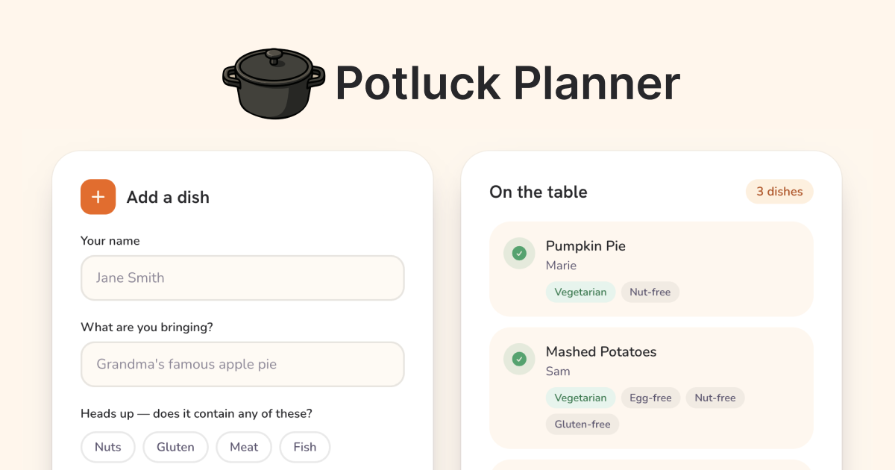

# Potluck Planner

Potluck pages you can share so people know what to bring.



Live at [potluck.lukefernandez.io](https://potluck.lukefernandez.io).

## Overview

Potluck Planner is a free sign-up sheet for potlucks and gatherings. Create a potluck page — no account needed — and share the link with friends and
family. People can add what they're bringing (with flags for common
allergens and dietary restrictions), so the group can see what's covered and
what's still missing.

Potluck pages are unlisted. They're reachable only by their guid-backed links and are kept out of search indexes.

## Architecture

The repo is a Bun workspace with three packages:

- `packages/web` — the Next.js app, deployed to Vercel at
  [potluck.lukefernandez.io](https://potluck.lukefernandez.io).
- `packages/functions` — the API's Lambda handlers, deployed to AWS via
  [SST](https://sst.dev) along with a DynamoDB table (single-table design) and a cron job that keeps the Lambdas warm.
- `packages/contract` — the shapes crossing the web ↔ API seam: zod input schemas, resource and response-envelope types, the dietary-flags registry that drives the schema fields, form chips, badges, and the route manifest that `sst.config.ts`, the warmer, and the web client all read.

The API's shape is defined by the zod schemas and response-envelope types in `packages/contract`, and domain vocabulary lives in [`CONTEXT.md`](CONTEXT.md).

## Development

```sh
bun install     # install dependencies
bun run dev     # run the web app locally
bun run test    # run all tests
bun run lint    # oxlint
bun run format  # oxfmt
bun run typecheck
```

## Tests

Unit tests run on `bun run test`, next to the code they cover.

The input validation rules and dietary-badge logic (`contract`) are tested as pure functions, and each API handler (`functions`) is tested with DynamoDB stubbed via `aws-sdk-client-mock`.

The route chassis (the shared plumbing for request validation, error responses, and keep-warm pings) has its own suite, so that behavior is tested once rather than re-tested in every handler.

The forms (`web`) are tested in a simulated browser (happy-dom + Testing Library) and submitted with `fetch` mocked at the network boundary.

## License

[MIT](LICENSE)
